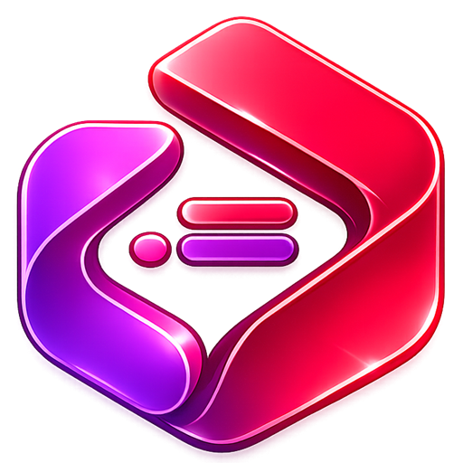

<p align="center">
  
</p>

<h1 align="center">Movo</h1>

<p align="center">
  A desktop AI studio for coding, terminals, dev servers, project workflows, and Pinoox-powered building.
</p>

<p align="center">
  <a href="../../releases/latest/download/Movo-Setup-Windows.exe"><strong>Download for Windows</strong></a>
  |
  <a href="../../releases/latest/download/Movo-Installer-macOS.dmg"><strong>Download for macOS</strong></a>
  |
  <a href="../../releases/latest/download/Movo-Linux.AppImage"><strong>Download for Linux</strong></a>
  |
  <a href="../../releases/latest"><strong>Latest release</strong></a>
</p>

<p align="center">
  
  
  
  
  
</p>

Movo is a focused desktop workspace for building and maintaining software with AI. It combines a project-aware chat, real terminals, live activity logs, file mentions, attachments, dev servers, agents, MCP integrations, and Pinoox workflows in one app.

Movo has its own identity, UI, settings, and workflow layer. Under the hood, it is powered in part by Xiaomi's MiMo Code engine for AI coding execution.

## Table Of Contents

- [Download](#download)
- [Support Movo](#support-movo)
- [Why Movo](#why-movo)
- [Features](#features)
- [Chat Workspace](#chat-workspace)
- [Terminals And Dev Servers](#terminals-and-dev-servers)
- [Pinoox](#pinoox)
- [Agents, Commands, MCP, Skills](#agents-commands-mcp-skills)
- [Privacy And Workspace Trust](#privacy-and-workspace-trust)
- [Development](#development)
- [Release Automation](#release-automation)

## Download

Use the direct links below to download the latest published installer. The [latest release page](../../releases/latest) shows publish time, file size, and release notes for each uploaded installer.

| Platform | Installer | Direct latest download | Release time and size |
| --- | --- | --- | --- |
| Windows | `.exe` setup | [Movo-Setup-Windows.exe](../../releases/latest/download/Movo-Setup-Windows.exe) | Shown on the [latest release](../../releases/latest) |
| macOS | `.dmg` installer | [Movo-Installer-macOS.dmg](../../releases/latest/download/Movo-Installer-macOS.dmg) | Shown on the [latest release](../../releases/latest) |
| Linux | `.AppImage` | [Movo-Linux.AppImage](../../releases/latest/download/Movo-Linux.AppImage) | Shown on the [latest release](../../releases/latest) |
| Linux | `.deb` | [Movo-Linux.deb](../../releases/latest/download/Movo-Linux.deb) | Shown on the [latest release](../../releases/latest) |

Direct download links always point to the newest published release because the release workflow uploads stable asset names.

## Support Movo

If Movo helps you build faster, you can support the project. Donations are optional, but they help with development time, testing, packaging, documentation, and keeping Pinoox-focused workflows improving.

### Crypto

You can donate with TON-compatible wallets. This wallet address supports the TON network and TON-based assets such as TON and USDT on TON.

```text
UQBQwGiT0DbnWPvxuYa9EVYVVtniyDmzltBiVghOhozz-vJQ
```

Compatible donation options:

- TON on the TON network.
- USDT on the TON network.

You can use Tonkeeper or any other wallet that supports the TON network. If the wallet link below does not open from GitHub, copy the address manually.

[Donate with a TON wallet](ton://transfer/UQBQwGiT0DbnWPvxuYa9EVYVVtniyDmzltBiVghOhozz-vJQ)

Please use only the TON network for this address. Do not send ERC20, TRC20, BSC, Polygon, or other network transfers to this wallet address.

### Other Support Options

Recommended options to add later:

- GitHub Sponsors for international developers.
- Buy Me a Coffee or Ko-fi for small one-time donations.
- Open Collective for transparent community funding.
- Local Iranian payment links for Rial/Toman support, if you have a trusted payment provider.

## Why Movo

Movo is built for the moments when a normal chat window is not enough. It keeps the conversation close to the project, shows what the AI is doing while it works, lets you run real commands, tracks file changes, and keeps context such as files, terminals, agents, and sessions organized.

It is especially useful when you want to:

- Build or edit a project without constantly switching between chat, terminal, files, and browser.
- Ask the AI to read, write, refactor, debug, or explain code while seeing each step.
- Keep multiple project chats running independently.
- Use Pinoox-specific workflows with a unified Pinoox agent.
- Run local dev servers and inspect logs from the same workspace.
- Keep Movo settings cleanly separated from hidden engine internals.

## Features

### Project-Aware AI

- Persistent chats per project folder.
- Draft recovery, queued messages, and multi-chat runs.
- Automatic scroll behavior similar to modern AI coding tools.
- Revert, edit, fork, export, and import sessions.
- Copied Movo message IDs can be reused in future prompts.
- Follow-up prompts can reference previous Movo messages by ID.

### Live Activity Log

- Real-time read, write, edit, search, command, permission, and diff events.
- Collapsible "Worked for..." summaries after completion.
- Better visual cards for reading directories, reading files, editing files, and writing files.
- Error activity is separated visually from normal background system noise.
- Project-related file activity is shown without exposing internal engine metadata.

### Rich Markdown Chat

- Tables, callouts, task lists, workflow lists, dividers, details blocks, and code fences.
- Syntax highlighting for common languages.
- Diff rendering with added and removed lines.
- RTL/LTR detection for Persian and English text.
- Clickable links and clickable file paths.
- Looser Markdown support such as `** text**`, `* text *`, and similar emphasis variants.

### Files And Attachments

- `@file` mentions with fuzzy picking.
- Drag and drop files into chat as context.
- Image attachments with preview and enlarged modal view.
- Binary files are treated as attachments instead of broken code mentions.
- External file paths are preserved when possible.
- File and folder links can open in the system file manager.

### Terminals

- Real terminal experience powered by xterm.
- Multiple terminals per chat/folder.
- Floating terminal window mode.
- Open the current project folder in the system terminal.
- Stop running terminal commands.
- Terminal sessions are isolated between chats and folders.

### Dev Servers

- Generic Dev Servers panel, not limited to Vite.
- Run any server command inside the selected project folder.
- Presets for common stacks such as Node, Laravel, Django, Flask, Go, Rust, Deno, Bun, pnpm, Yarn, and Docker Compose.
- Logs appear in the real terminal below the Dev Server entry.
- Stop, remove, and focus a server from the UI.

## Chat Workspace

Movo's chat is designed to feel close to the project. It supports:

- Final answers plus expandable work history.
- Live "what Movo is doing" updates.
- Markdown answers with rich styling.
- Message actions such as copy, copy ID, edit, and revert.
- Agent selection: Ask, Debug, Agent, and Pinoox.
- Context from commands using `!command`.
- Slash commands such as `/new`, `/compact`, and `/sessions`.

## Terminals And Dev Servers

Movo treats terminals as part of the workspace, not as a side output panel. You can create multiple terminals, keep them per chat or folder, float the terminal panel, and run real commands from the selected project root.

The Dev Servers section sits above the terminal and gives you a quick way to launch framework servers while keeping the logs visible and controllable.

## Pinoox

Movo includes a unified Pinoox agent designed around the Pinoox ecosystem. It can adapt to:

- Architecture planning.
- Single app and app builder workflows.
- Migration tasks.
- UI building.
- Security review.
- Documentation writing.
- Marketplace and package publishing workflows.

Movo can also use Pinoox MCP defaults and Pinoox-aware commands when available.

## Agents, Commands, MCP, Skills

Movo supports configurable:

- Agents
- Commands
- Skills
- MCP servers
- Tool configuration
- LSP configuration
- Formatters
- Keybindings
- Engine server settings

Default capabilities are merged in the background while user settings stay clean and editable.

## Privacy And Workspace Trust

Movo keeps project trust explicit. Workspaces are untrusted by default, and project-specific Movo settings are only written when trust is enabled.

When trusted, Movo uses `.movo` and `movo.json` for Movo project settings. Engine configuration is injected globally so normal projects do not need visible `.mimocode` metadata.

## Engine

Movo is transparent about its foundation. It can say that it uses the MiMo Code engine, but the app identity, UX, settings, release flow, and project workflow belong to Movo.

## Development

Install dependencies:

```bash
npm ci
```

Run Movo in development:

```bash
npm run dev
```

Run checks:

```bash
npm run typecheck
```

Build installers locally:

```bash
npm run build:win
npm run build:mac
npm run build:linux
```

Build output is written to `release/`.

## Release Automation

Publishing a GitHub Release automatically builds production installers for Windows, macOS, and Linux.

The release workflow uploads stable asset names so the README download buttons always point to the newest release:

- `Movo-Setup-Windows.exe`
- `Movo-Installer-macOS.dmg`
- `Movo-Linux.AppImage`
- `Movo-Linux.deb`

Release process:

1. Update `package.json` version.
2. Create a tag such as `v0.1.0`.
3. Create a GitHub Release from that tag.
4. Publish the release.
5. Wait for the release workflow to attach installers automatically.
